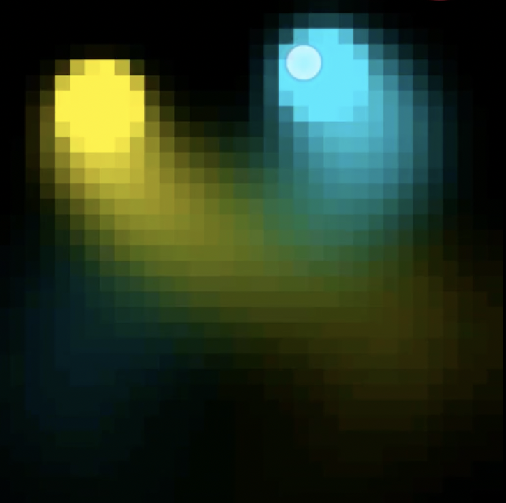

# touch-pair

An exploration of intimacy and closeness at a distance, from Sex Tech Hack 2017.

For more information, see: [Touch Pairing](https://docs.google.com/presentation/d/e/2PACX-1vQ6WWyyAQK2A0zYRuIGV08vqbZNXCCNvZ7h2FKTWlEbGmWwpb4VgB6j33RiXuWx9NCOr5xJVq7FmFCb/pub?start=false&loop=false&delayms=3000)

_Touch Pairing is an experimental app that pairs two screens, and mirrors touch gestures between people._

* [Videos](docs/videos/)
